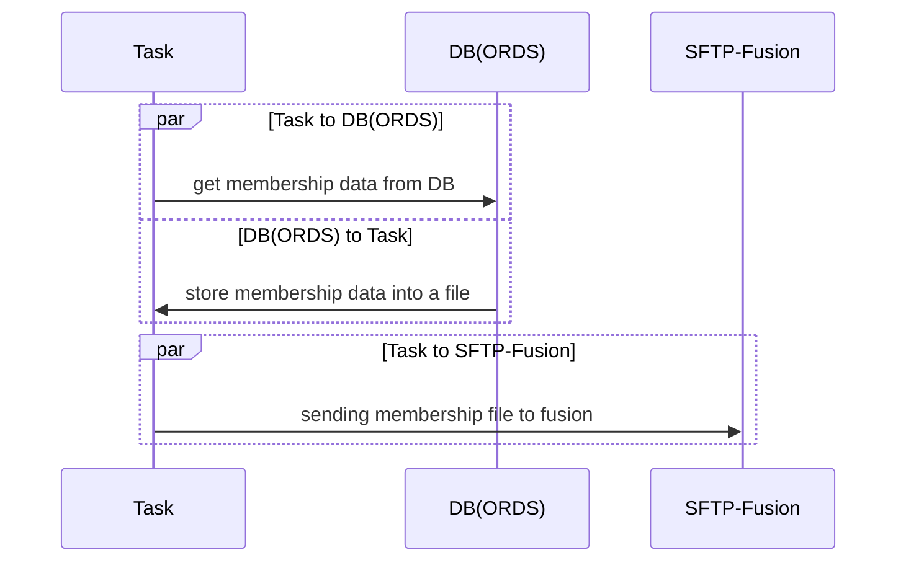
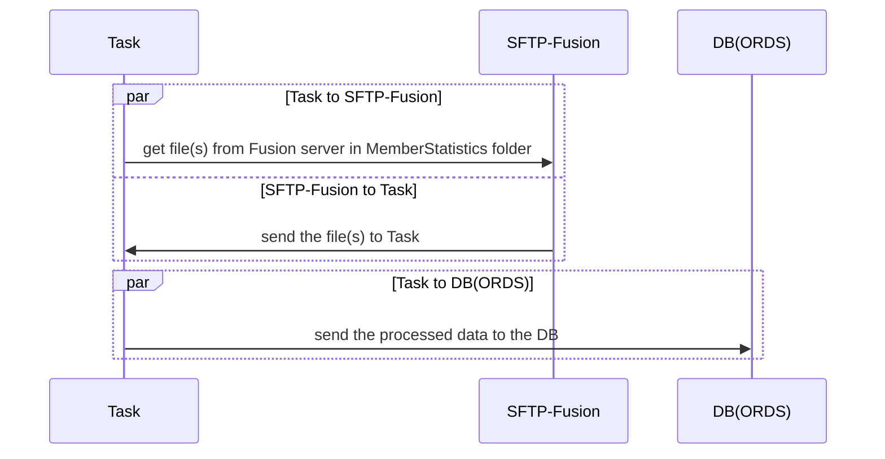
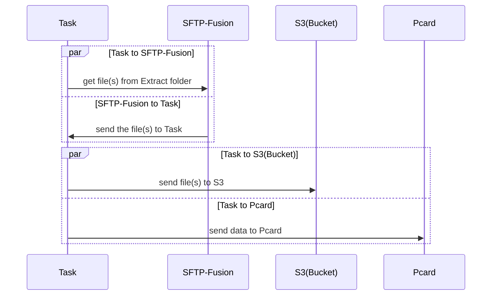

# Overview
The Fusion tasks are usually transferring data between Fusion sftp server and the Pcard service and ORDS. There are 3 tasks in the task-runner-container. 

* Member Portal URL: https://myrec.gsu.edu/
* This Specific Query: https://myrec.gsu.edu/Query?apiId=memstat (Authentication and proper permission required)

## Description

* Transfer the membership data from ORDS to the Fusion SFTP server that name is "georgiastate.innosoftfusion.com".
* Transfer member's file from Fusion SFTP server that folder name is "MemberStatistics" to the ORDS.
* Transfer member's file from Fusion SFTP server that folder name is "Extract" to the Pcard server.

### Fusion SFTP

* Host: georgiastate.innosoftfusion.com
* User: GSU
* Key file: [Lastpass]

## FLOW

### fusion-getdemographics
* Run everyday at 2:30:00 AM
> 1. Get membership data from DB(ORDS)
> 2. Store the data into a file
> 3. Send the file to the Fusion server via sftp


* This task finally creates "gsuDemographicsNewFormat.csv" into fusion sftp server.
* File format:
```
[
      "pantherId",
      "firstName",
      "middleInitial",
      "lastName",
      "externalUser",
      "gender",
      "pidm",
      "birthdate",
      "email",
      "feePaying",
      "tuitionRemission",
      "enrolled",
      "primaryCampus",
      "fullPartTime",
      "membershipType",
      "customType",
      "employeeId",
      "employeeGsu",
      "employeeOther",
      "isStudent",
      "isAlumni",
      "isEmployee",
      "isRetiree"
]
 
```


### fusion-innoapi
* Run everyday at 4:00:00 PM
> 1. Get membership data from DB(ORDS)
> 2. Send the file(s) to Task
> 3. Send the processed data to the DB


* This task creates data into FUSION_ACTIVITY_API table in Biprod DB.
Dat format:
```
[
    'PantherID', 
    'FirstName', 
    'LastName', 
    'PartyId', 
    'Description'
]
```

### fusion-update
* Run everyday at 3:50:00 AM 
> 1. Get membership data from Fusion server in Extract folder
> 2. Send the file(s) to Task
> 3. Send the data by processed to the Pcard


* This jog creates data into pcarprodproxy.server.gsu.edu server. 
* Data format: [pantherid,[AddorRemove],20230228]

## External Resources

* task-runner-container – https://github.com/gastate/documentation/wiki/Infrastructure:-Task-Runner-Container
* Tasks – https://github.com/gastate/documentation/wiki#tasks
* ORDS - https://github.com/gastate/documentation/wiki/ORDS

